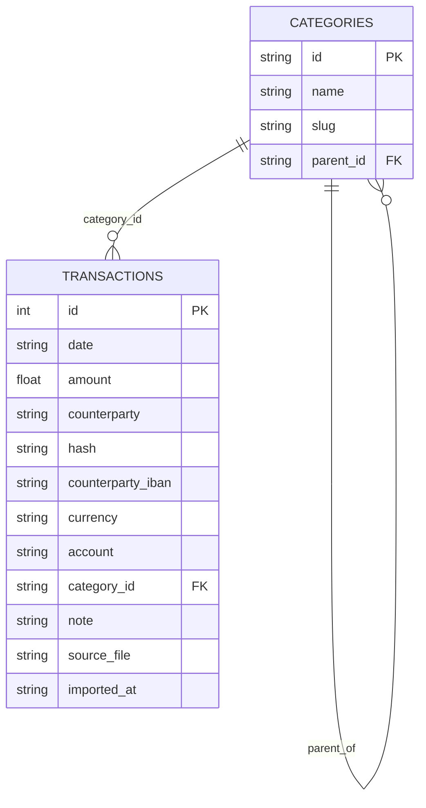

# Database Directory

This directory contains SQLite schema and data access code for flouz.

## Schema

## Conventions

- Group SQL by table directory
- Use `queries.ts` for reads and `mutations.ts` for writes
- Keep seeding only in tables that require bootstrap data
- See the per-table `README.md` files for table-specific details